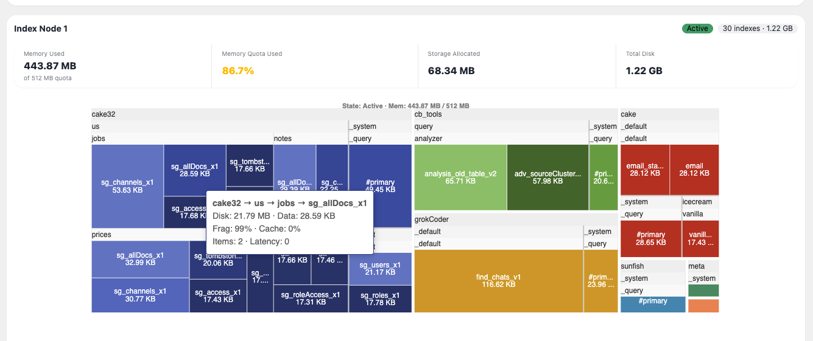
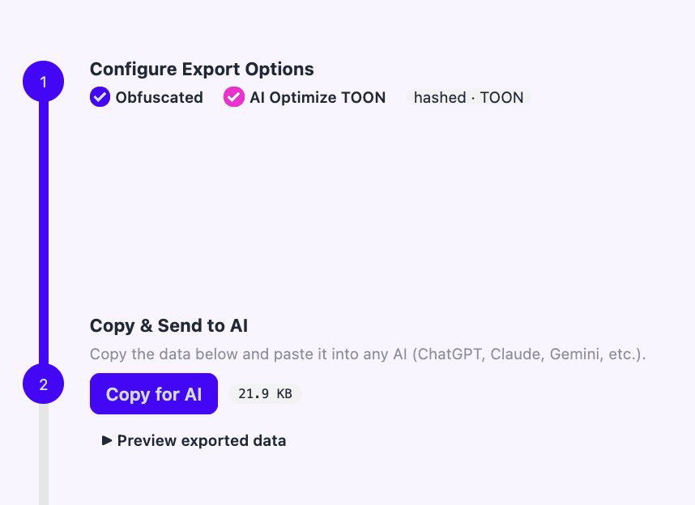
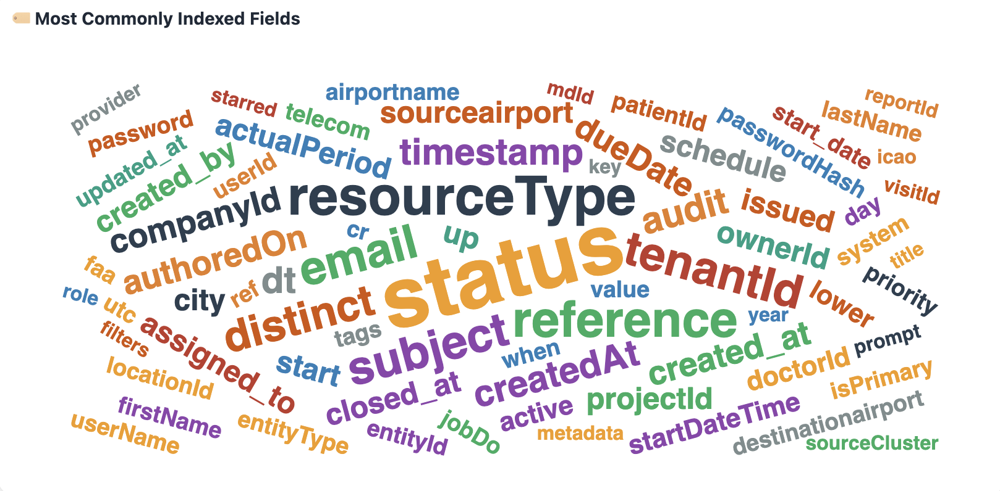

# 🗺️ CB Index Treemap

**Visualize, analyze, and fix your Couchbase GSI index distribution — right in your browser.**

---

## 😩 The Problem

You've got a Couchbase cluster with dozens (or hundreds) of GSI indexes scattered across buckets, scopes, and collections. You need answers to basic questions like:

- **"Can I fit more indexes on this node?"**
- **"Which indexes are eating all my disk?"**
- **"Are any of my indexes slow, fragmented, or never even used?"**
- **"What's my memory quota situation looking like?"**
- **"My nodes are unbalanced — how do I fix it?"**

Couchbase gives you the raw data, but staring at giant JSON blobs from `system:indexes` or the Stats API isn't exactly fun. You need a way to *see* it — and then *do* something about it.

## 💡 Step 1: See It

CB Index Treemap turns raw Couchbase JSON into interactive treemaps, bar charts, pie charts, word clouds, and sortable tables so you can instantly spot problems and understand your index landscape.



Paste your `system:indexes` output to see your index structure. Add Stats API data from each index node to see sizes, performance metrics, and the **Lumpiness Score** — a composite score (0–100) that tells you how evenly your indexes are distributed across nodes.

## 🔧 Step 2: Fix It

Great, so now you can *see* that Node 1 has 80% of your disk usage while Node 2 is sitting idle. Or that half your indexes haven't been scanned in months. **But what do you actually do about it?**

That's where the **Index Placement Optimizer** tab comes in. It gives you two ways to fix unbalanced index distributions:

- **Plan A: Greedy Placement** — The built-in algorithm automatically computes an optimized distribution. It scores every node, places indexes largest-first, enforces replica separation, and generates ready-to-run `ALTER INDEX` statements. One click to copy, paste into Query Workbench, and you're done.

- **Plan B: AI Optimize** — Export your index topology (with privacy-safe obfuscated hashes), send it to any AI — ChatGPT, Claude, Gemini, whatever you prefer — and import the AI's proposed arrangement back. The tool de-hashes everything, scores the AI's plan with the same Lumpiness Score, and generates the `ALTER INDEX` statements for you.



Both plans show you a **before → after Lumpiness Score comparison**, a detailed **moves table**, and the exact **ALTER INDEX statements** to execute. You go from "I see the problem" to "here's the fix" without leaving the tool.

---

## 🚀 What It Can Do For You

### 📊 System Indexes Tab
- Paste your `system:indexes` query output and get an interactive **treemap visualization** of every index organized by **Bucket → Scope → Collection → Index**
- **🏷️ Word cloud** of most commonly indexed fields — see your hottest fields at a glance


- **Index Count by Bucket** with **Pie / Bar toggle** — bar view shows stacked collections per bucket.scope
- Quickly see your index structure at a glance

### 📈 Stats API Tab
- Paste index node stats and get **sized treemaps** where box size = actual disk usage
- **Full sortable stats table** with every metric — Disk, Data, Bloat, Frag%, Items, Resident%, Memory, Cache%, Latency, Pending, Requests, Last Scan
- **🔍 Index Stats Detail Modal** — Click the **Stats** button on any index row to open a comprehensive detail view with an Efficiency Grade (A–F), 4 interactive charts (Storage Breakdown, Health Gauges, Scan Outcomes, Cache Performance), and a full stats table grouped by category with tooltips on every metric
- **Bar charts** for lowest cache hit % and highest scan latency
- **Node-level summary cards** showing memory used vs quota, storage allocated, and total disk
- **📐 Lumpiness Score** — When multiple index nodes are loaded, a composite score (0–100) shows how evenly indexes are distributed across nodes. Weighted by index count balance (30%), disk size balance (30%), memory balance (20%), and replica spread (20%). Color-coded ratings from Excellent to Critical with per-node breakdown details.
- **Treemap zoom & pan toolbar** — 🏠 reset, ➕/➖ zoom, ⬆️⬅️➡️⬇️ pan with a zoom level badge
- **Click a treemap box** → table row highlights and scrolls into view. **Click a table row** → treemap box highlights. 🤝
- **Last Scan timestamps** displayed in **ISO 8601** format for easy comparison

### 🔍 Analysis Tab
- **Summary dashboard** — total disk, data, memory, avg fragmentation, avg resident %, never-scanned count
- **📦 Index Item Count Distribution** — bar or pie chart showing how indexes are spread across percentile buckets by item count
- **Pie / Bar charts** — disk and memory usage broken down by bucket, with toggle to switch between pie and stacked bar (by scope) views
- **Top 10 / Bottom 10 leaderboards** — largest disk, highest fragmentation, lowest cache hit, highest bloat, most requests, and more
- **⚠️ Never-scanned indexes list** — indexes burning disk but never queried. Prime candidates for cleanup!

### 💃 Index Placement Optimizer Tab *(Beta)*
- **Plan A: Built-in Rebalance** — Greedy algorithm computes an optimized placement and generates `ALTER INDEX` statements
- **Plan B: AI-Assisted Rebalance** — Export topology with obfuscated hashes + TOON token optimization, send to any AI, import the result back. The tool de-hashes, scores, and generates ALTER INDEX statements.
- **🎯 Greedy / Performance Strategy Toggle** — Choose between **Greedy** (balance by size/count) and **Performance** (spread hot indexes across nodes using scan requests, latency, and throughput metrics). The selected strategy is embedded in AI exports so the AI follows the same optimization goal.
- **⭐ Priority Indexes** — Mark specific indexes as "priority" so the optimizer places them on nodes with the least memory load, maximizing the chance they stay fully resident in RAM. Priority selections are included in both Plan A (built-in) and Plan B (AI) exports. The moves table shows "Priority — placed for best memory" reasoning for any prioritized index that was moved.
- **🔢 Critical Count Check** — AI exports include an explicit count check requiring the AI to return the exact same number of index entries. If the AI drops indexes, a detailed error alert lists every missing index.
- **⚠️ File-Based Rebalance Warning** — Banner alerting users that `ALTER INDEX` with `nodes` clause is not supported when file-based rebalance is enabled, with links to Couchbase docs.
- **Lumpiness Score: Before → After** — Radial gauge comparison showing how much the rebalance improves distribution
- **Proposed Moves table** with source → destination nodes, disk sizes, and reasoning
- **AI Reasoning display** — Auto-formatted with color-coded node badges, bold metrics, and de-obfuscated names
- Requires Stats API data with at least 2 nodes

### 📐 New Index Size Estimator Tab *(Beta)*
- **Paste a sample JSON document**, a sample Document ID/Key, and a `CREATE INDEX` statement to estimate how much disk and memory a new index will consume before you create it
- Uses actual Couchbase indexer internals — **CollatJSON binary encoding**, forward + back index dual-store layout, 2-byte entry trailers, and MOI skiplist node overhead (52 bytes) — to produce accurate size estimates
- **Storage engine comparison** — Estimate for **Plasma** (Enterprise Std GSI), **MOI / Nitro** (Enterprise Mem-Opt), and **ForestDB** (Community Edition) side-by-side, or pick one engine
- **Configurable parameters** — Number of documents, number of replicas, array length, and resident ratio
- **Interactive results chart** — Visual breakdown of estimated index size by engine with per-entry and total size details
- Supports composite indexes, array indexes (`DISTINCT ARRAY`), partial indexes (`WHERE` clause), and nested field paths

### 🔧 Global Filters & UX
- Filter everything by **Bucket**, **Scope**, **Collection**, **Index Name**, or **Node** — all tabs update instantly
- **Multi-node selection** — Filter by one or more index nodes simultaneously
- **Scan history filter** — Show All, Exclude Never Scanned, or Only Never Scanned indexes
- **🔎 Indexed Field Filter** — Filter indexes by field names with wildcard support (`city_*`, `*_id`, `addr.*`). Fuzzy autocomplete powered by uFuzzy shows matching fields with index counts as you type.
- **⛶ Chart Expand** — Click the expand (⛶) button on any chart to open it in a full-screen modal for detailed inspection
- **📊 Table / Bar / Pie Toggle** — Analysis tab leaderboard tables (Largest Disk, Highest Frag, etc.) and Never Scanned Indexes now offer Table, Bar, and Pie view toggles with expandable chart modals
- **💡 Tooltips everywhere** — Hover over any column header, stat card, filter dropdown, or button to see a plain-English explanation of what that metric means and why it matters

---

## 📥 How to Get the Data

You need data from two Couchbase sources:

### 1. System Indexes (index structure)

Run this SQL++ query in the **Query Workbench** or **cbq shell**:

```sql
SELECT *, meta() FROM system:indexes
```

Copy the entire JSON result.

### 2. Stats API (index sizes & performance metrics)

On **each index node**, run:

```bash
curl -u <username>:<password> "http://<index-node-hostname>:9102/api/v1/stats?pretty=true"
```

> **Port 9102** is the GSI admin port. You'll need cluster credentials with admin access.

For example, if your cluster has 5 nodes (3 Data + 2 Index), you'd run this curl on each of the 2 index nodes to get stats for all indexes on that node.

---

## 🖥️ How to Use the Tool

**With Docker (recommended):** `docker compose up` then open [http://localhost:3000](http://localhost:3000). Your data saves automatically.

**Without Docker:** Just open `index.html` in your browser. Everything works, but data won't persist across refreshes.

### System Indexes Tab

1. Paste your `SELECT *, meta() FROM system:indexes` JSON output into the text area
2. Click **Load & Render**
3. Explore your index structure in the treemap

### Stats API Tab

1. Paste your first index node's stats JSON into the text area
2. **Give it a name!** — Update the node name field (e.g., `idx-node1.prod.local`) so you can tell your nodes apart
3. Click **Load & Render**

#### Adding Multiple Index Nodes

Most clusters have more than one index node. To add them all:

1. Click **+ Add node**
2. A new text area appears — paste that node's stats JSON
3. **Remember to name each node** (e.g., `idx-node2.prod.local`) — this label appears as the section header and helps you identify which node is which
4. Repeat for all index nodes in your cluster
5. Click **Load & Render** — you'll get a separate treemap, charts, and stats table for each node

> 💡 **Tip:** Couchbase clusters often have index replicas, so you may see the same index name on multiple nodes. The node labels help you keep track of what lives where.

### Analysis Tab

1. Load data in the **System Indexes** tab and/or the **Stats API** tab first
2. Switch to the **Analysis** tab — it combines everything into a single dashboard
3. Use the global filter bar at the top to drill down by bucket, scope, collection, or index name

### Index Placement Optimizer Tab

1. Load Stats API data with **at least 2 nodes**
2. Switch to the **Index Placement Optimizer** tab
3. **Plan A** runs automatically — review the proposed moves and ALTER INDEX statements
4. **Plan B** — configure export options, copy for AI, paste back the AI's response, and click **Load AI Plan**

### 💾 Saving & Loading (Docker mode)

When running with Docker, you don't have to re-paste your data every time:

1. After pasting data, click the **💾 Save** button (System Indexes tab) or **💾 Save All Nodes** (Stats tab)
2. **Refresh the page** — your data auto-loads and renders automatically
3. Click the **💾** button in the navbar to open the **File Manager** — view, delete individual files, or wipe everything

### 🎛️ Toggle Metrics

In the Stats API tab, use the **Disk Size / Data Size** toggle to switch what the treemap boxes are sized by.

---

## 🐳 Running with Docker (Recommended)

The Docker setup adds a lightweight Node.js server so your pasted data **saves to disk** and survives page refreshes and container restarts.

```bash
docker compose up
```

Open [http://localhost:3000](http://localhost:3000) — that's it.

### What you get

- **💾 Save buttons** — click "Save" next to "Load & Render" on either tab to persist your JSON to the server
- **Auto-load on refresh** — saved data automatically repopulates the textareas and renders on page open. No more re-pasting!
- **File manager** — click the 💾 button in the navbar to see all saved files, delete individual files, or wipe everything
- **Persistent storage** — data lives in a Docker volume (`cb-index-data`), so `docker compose restart` or `docker compose down && docker compose up` keeps your data intact

### Useful commands

```bash
docker compose up -d        # run in background
docker compose restart      # restart (data persists)
docker compose down          # stop (data persists in volume)
docker compose down -v       # stop AND delete saved data
docker compose up --build    # rebuild after updating index.html
```

---

## ✅ Works On My Computer Certified ;-)

**Option A: Docker** — `docker compose up` and go to [http://localhost:3000](http://localhost:3000). Your data saves and survives restarts.

**Option B: Just the HTML** — Open `index.html` directly in your browser. Everything works, but you'll need to re-paste your data after each refresh. CDN links handle the rest (ECharts, DaisyUI, Tailwind CSS).

---

## 📦 Current Release

**v2.5.0** — See [release notes](release_notes.md) for details.

---

## 📄 License

See [LICENSE](LICENSE) for details.
